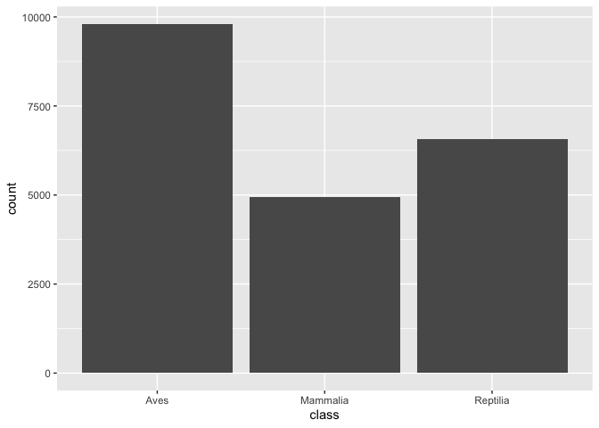
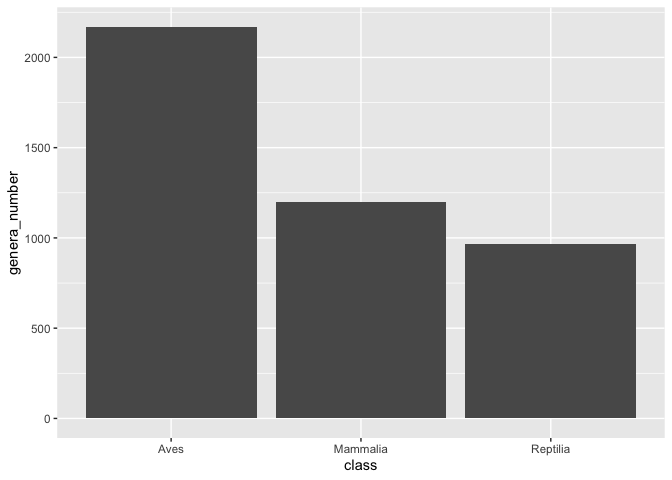
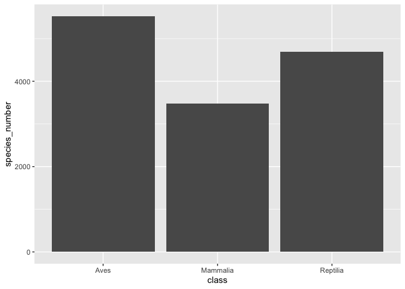
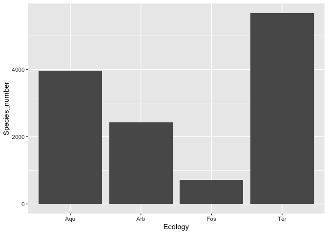
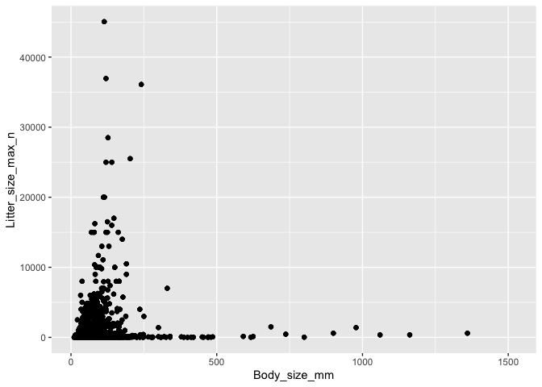
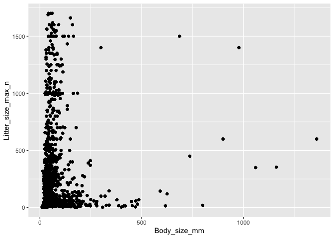

## Instructions
Answer the following questions and complete the exercises in RMarkdown. Please embed all of your code and push your final work to your repository. Your final lab report should be organized, clean, and run free from errors. Remember, you must remove the `#` for the included code chunks to run.  

## Libraries


```r
install.packages("naniar", repos = "http://cran.us.r-project.org")
```

```
## 
## The downloaded binary packages are in
## 	/var/folders/m4/s77txng10gn2r8wd35sy85ww0000gn/T//RtmpLGJHv7/downloaded_packages
```

```r
install.packages("skimr", repos = "http://cran.us.r-project.org")
```

```
## 
## The downloaded binary packages are in
## 	/var/folders/m4/s77txng10gn2r8wd35sy85ww0000gn/T//RtmpLGJHv7/downloaded_packages
```


```r
library(tidyverse)
```

```
## ── Attaching packages ─────────────────────────────────────── tidyverse 1.3.0 ──
```

```
## ✓ ggplot2 3.2.1     ✓ purrr   0.3.3
## ✓ tibble  2.1.3     ✓ dplyr   0.8.4
## ✓ tidyr   1.0.2     ✓ stringr 1.4.0
## ✓ readr   1.3.1     ✓ forcats 0.4.0
```

```
## ── Conflicts ────────────────────────────────────────── tidyverse_conflicts() ──
## x dplyr::filter() masks stats::filter()
## x dplyr::lag()    masks stats::lag()
```

```r
library(naniar)
library(skimr)
```

```
## 
## Attaching package: 'skimr'
```

```
## The following object is masked from 'package:naniar':
## 
##     n_complete
```

## Data
For this homework, we will use two different data sets. Please load `amniota` and `amphibio`.  

### `amniota` data
Myhrvold N, Baldridge E, Chan B, Sivam D, Freeman DL, Ernest SKM (2015). “An amniote life-history
database to perform comparative analyses with birds, mammals, and reptiles.” _Ecology_, *96*, 3109.
doi: 10.1890/15-0846.1 (URL: https://doi.org/10.1890/15-0846.1).

```r
amniota <- 
  readr::read_csv("data/amniota.csv")
```

```
## Parsed with column specification:
## cols(
##   .default = col_double(),
##   class = col_character(),
##   order = col_character(),
##   family = col_character(),
##   genus = col_character(),
##   species = col_character(),
##   common_name = col_character()
## )
```

```
## See spec(...) for full column specifications.
```

### `amphibio` data
Oliveira BF, São-Pedro VA, Santos-Barrera G, Penone C, Costa GC (2017). “AmphiBIO, a global database
for amphibian ecological traits.” _Scientific Data_, *4*, 170123. doi: 10.1038/sdata.2017.123 (URL:
https://doi.org/10.1038/sdata.2017.123).

```r
amphibio <- 
  readr::read_csv("data/amphibio.csv")
```

```
## Parsed with column specification:
## cols(
##   .default = col_double(),
##   id = col_character(),
##   Order = col_character(),
##   Family = col_character(),
##   Genus = col_character(),
##   Species = col_character(),
##   Seeds = col_logical(),
##   OBS = col_logical()
## )
```

```
## See spec(...) for full column specifications.
```

```
## Warning: 125 parsing failures.
##  row col           expected                                                           actual                file
## 1410 OBS 1/0/T/F/TRUE/FALSE Identified as P. appendiculata in Boquimpani-Freitas et al. 2002 'data/amphibio.csv'
## 1416 OBS 1/0/T/F/TRUE/FALSE Identified as T. miliaris in Giaretta and Facure 2004            'data/amphibio.csv'
## 1447 OBS 1/0/T/F/TRUE/FALSE Considered endangered by Soto-Azat et al. 2013                   'data/amphibio.csv'
## 1448 OBS 1/0/T/F/TRUE/FALSE Considered extinct by Soto-Azat et al. 2013                      'data/amphibio.csv'
## 1471 OBS 1/0/T/F/TRUE/FALSE nomem dubitum                                                    'data/amphibio.csv'
## .... ... .................. ................................................................ ...................
## See problems(...) for more details.
```

## Questions  
**1. First, do some exploratory analysis of both data sets. What is the structure, column names, and dimensions?** 


```r
glimpse(amniota)
```

```
## Observations: 21,322
## Variables: 36
## $ class                                 <chr> "Aves", "Aves", "Aves", "Aves",…
## $ order                                 <chr> "Accipitriformes", "Accipitrifo…
## $ family                                <chr> "Accipitridae", "Accipitridae",…
## $ genus                                 <chr> "Accipiter", "Accipiter", "Acci…
## $ species                               <chr> "albogularis", "badius", "bicol…
## $ subspecies                            <dbl> -999, -999, -999, -999, -999, -…
## $ common_name                           <chr> "Pied Goshawk", "Shikra", "Bico…
## $ female_maturity_d                     <dbl> -999.000, 363.468, -999.000, -9…
## $ litter_or_clutch_size_n               <dbl> -999.000, 3.250, 2.700, -999.00…
## $ litters_or_clutches_per_y             <dbl> -999, 1, -999, -999, 1, -999, -…
## $ adult_body_mass_g                     <dbl> 251.500, 140.000, 345.000, 142.…
## $ maximum_longevity_y                   <dbl> -999.00000, -999.00000, -999.00…
## $ gestation_d                           <dbl> -999, -999, -999, -999, -999, -…
## $ weaning_d                             <dbl> -999, -999, -999, -999, -999, -…
## $ birth_or_hatching_weight_g            <dbl> -999, -999, -999, -999, -999, -…
## $ weaning_weight_g                      <dbl> -999, -999, -999, -999, -999, -…
## $ egg_mass_g                            <dbl> -999.00, 21.00, 32.00, -999.00,…
## $ incubation_d                          <dbl> -999.00, 30.00, -999.00, -999.0…
## $ fledging_age_d                        <dbl> -999.00, 32.00, -999.00, -999.0…
## $ longevity_y                           <dbl> -999.00000, -999.00000, -999.00…
## $ male_maturity_d                       <dbl> -999, -999, -999, -999, -999, -…
## $ inter_litter_or_interbirth_interval_y <dbl> -999, -999, -999, -999, -999, -…
## $ female_body_mass_g                    <dbl> 352.500, 168.500, 390.000, -999…
## $ male_body_mass_g                      <dbl> 223.000, 125.000, 212.000, 142.…
## $ no_sex_body_mass_g                    <dbl> -999.0, 123.0, -999.0, -999.0, …
## $ egg_width_mm                          <dbl> -999, -999, -999, -999, -999, -…
## $ egg_length_mm                         <dbl> -999, -999, -999, -999, -999, -…
## $ fledging_mass_g                       <dbl> -999, -999, -999, -999, -999, -…
## $ adult_svl_cm                          <dbl> -999.00, 30.00, 39.50, -999.00,…
## $ male_svl_cm                           <dbl> -999, -999, -999, -999, -999, -…
## $ female_svl_cm                         <dbl> -999, -999, -999, -999, -999, -…
## $ birth_or_hatching_svl_cm              <dbl> -999, -999, -999, -999, -999, -…
## $ female_svl_at_maturity_cm             <dbl> -999, -999, -999, -999, -999, -…
## $ female_body_mass_at_maturity_g        <dbl> -999, -999, -999, -999, -999, -…
## $ no_sex_svl_cm                         <dbl> -999, -999, -999, -999, -999, -…
## $ no_sex_maturity_d                     <dbl> -999, -999, -999, -999, -999, -…
```


```r
names(amniota)
```

```
##  [1] "class"                                
##  [2] "order"                                
##  [3] "family"                               
##  [4] "genus"                                
##  [5] "species"                              
##  [6] "subspecies"                           
##  [7] "common_name"                          
##  [8] "female_maturity_d"                    
##  [9] "litter_or_clutch_size_n"              
## [10] "litters_or_clutches_per_y"            
## [11] "adult_body_mass_g"                    
## [12] "maximum_longevity_y"                  
## [13] "gestation_d"                          
## [14] "weaning_d"                            
## [15] "birth_or_hatching_weight_g"           
## [16] "weaning_weight_g"                     
## [17] "egg_mass_g"                           
## [18] "incubation_d"                         
## [19] "fledging_age_d"                       
## [20] "longevity_y"                          
## [21] "male_maturity_d"                      
## [22] "inter_litter_or_interbirth_interval_y"
## [23] "female_body_mass_g"                   
## [24] "male_body_mass_g"                     
## [25] "no_sex_body_mass_g"                   
## [26] "egg_width_mm"                         
## [27] "egg_length_mm"                        
## [28] "fledging_mass_g"                      
## [29] "adult_svl_cm"                         
## [30] "male_svl_cm"                          
## [31] "female_svl_cm"                        
## [32] "birth_or_hatching_svl_cm"             
## [33] "female_svl_at_maturity_cm"            
## [34] "female_body_mass_at_maturity_g"       
## [35] "no_sex_svl_cm"                        
## [36] "no_sex_maturity_d"
```


```r
dim(amniota)
```

```
## [1] 21322    36
```


```r
glimpse(amphibio)
```

```
## Observations: 6,776
## Variables: 38
## $ id                      <chr> "Anf0001", "Anf0002", "Anf0003", "Anf0004", "…
## $ Order                   <chr> "Anura", "Anura", "Anura", "Anura", "Anura", …
## $ Family                  <chr> "Allophrynidae", "Alytidae", "Alytidae", "Aly…
## $ Genus                   <chr> "Allophryne", "Alytes", "Alytes", "Alytes", "…
## $ Species                 <chr> "Allophryne ruthveni", "Alytes cisternasii", …
## $ Fos                     <dbl> NA, NA, NA, NA, NA, 1, 1, 1, 1, 1, 1, 1, 1, N…
## $ Ter                     <dbl> 1, 1, 1, 1, 1, 1, 1, 1, 1, 1, 1, 1, 1, 1, 1, …
## $ Aqu                     <dbl> 1, 1, 1, 1, NA, 1, 1, 1, 1, 1, 1, 1, 1, 1, 1,…
## $ Arb                     <dbl> 1, 1, 1, 1, 1, 1, NA, NA, NA, NA, NA, NA, NA,…
## $ Leaves                  <dbl> NA, NA, NA, NA, NA, NA, NA, NA, NA, NA, NA, N…
## $ Flowers                 <dbl> NA, NA, NA, NA, NA, NA, NA, NA, NA, NA, NA, N…
## $ Seeds                   <lgl> NA, NA, NA, NA, NA, NA, NA, NA, NA, NA, NA, N…
## $ Fruits                  <dbl> NA, NA, NA, NA, NA, NA, NA, NA, NA, NA, NA, N…
## $ Arthro                  <dbl> 1, 1, 1, NA, 1, 1, 1, 1, 1, NA, 1, 1, NA, NA,…
## $ Vert                    <dbl> NA, NA, NA, NA, NA, NA, 1, NA, NA, NA, 1, 1, …
## $ Diu                     <dbl> 1, NA, NA, NA, NA, NA, 1, 1, 1, NA, 1, 1, NA,…
## $ Noc                     <dbl> 1, 1, 1, NA, 1, 1, 1, 1, 1, NA, 1, 1, 1, NA, …
## $ Crepu                   <dbl> 1, NA, NA, NA, NA, 1, NA, NA, NA, NA, NA, NA,…
## $ Wet_warm                <dbl> NA, NA, NA, NA, 1, 1, NA, NA, NA, NA, 1, NA, …
## $ Wet_cold                <dbl> 1, NA, NA, NA, NA, NA, 1, NA, NA, NA, NA, NA,…
## $ Dry_warm                <dbl> NA, NA, NA, NA, NA, NA, NA, NA, NA, NA, NA, N…
## $ Dry_cold                <dbl> NA, NA, NA, NA, NA, NA, NA, NA, NA, NA, NA, N…
## $ Body_mass_g             <dbl> 31.00, 6.10, NA, NA, 2.31, 13.40, 21.80, NA, …
## $ Age_at_maturity_min_y   <dbl> NA, 2.0, 2.0, NA, 3.0, 2.0, 3.0, NA, NA, NA, …
## $ Age_at_maturity_max_y   <dbl> NA, 2.0, 2.0, NA, 3.0, 3.0, 5.0, NA, NA, NA, …
## $ Body_size_mm            <dbl> 31.0, 50.0, 55.0, NA, 40.0, 55.0, 80.0, 60.0,…
## $ Size_at_maturity_min_mm <dbl> NA, 27, NA, NA, NA, 35, NA, NA, NA, NA, NA, N…
## $ Size_at_maturity_max_mm <dbl> NA, 36.0, NA, NA, NA, 40.5, NA, NA, NA, NA, N…
## $ Longevity_max_y         <dbl> NA, 6, NA, NA, NA, 7, 9, NA, NA, NA, NA, NA, …
## $ Litter_size_min_n       <dbl> 300, 60, 40, NA, 7, 53, 300, 1500, 1000, NA, …
## $ Litter_size_max_n       <dbl> 300, 180, 40, NA, 20, 171, 1500, 1500, 1000, …
## $ Reproductive_output_y   <dbl> 1, 4, 1, 4, 1, 4, 6, 1, 1, 1, 1, 1, 1, 1, NA,…
## $ Offspring_size_min_mm   <dbl> NA, 2.6, NA, NA, 5.4, 2.6, 1.5, NA, 1.5, NA, …
## $ Offspring_size_max_mm   <dbl> NA, 3.5, NA, NA, 7.0, 5.0, 2.0, NA, 1.5, NA, …
## $ Dir                     <dbl> 0, 0, 0, 0, 0, 0, 0, 0, 0, 0, 0, 0, 0, 0, 0, …
## $ Lar                     <dbl> 1, 1, 1, 1, 1, 1, 1, 1, 1, 1, 1, 1, 1, 1, 1, …
## $ Viv                     <dbl> 0, 0, 0, 0, 0, 0, 0, 0, 0, 0, 0, 0, 0, 0, 0, …
## $ OBS                     <lgl> NA, NA, NA, NA, NA, NA, NA, NA, NA, NA, NA, N…
```


```r
names(amphibio)
```

```
##  [1] "id"                      "Order"                  
##  [3] "Family"                  "Genus"                  
##  [5] "Species"                 "Fos"                    
##  [7] "Ter"                     "Aqu"                    
##  [9] "Arb"                     "Leaves"                 
## [11] "Flowers"                 "Seeds"                  
## [13] "Fruits"                  "Arthro"                 
## [15] "Vert"                    "Diu"                    
## [17] "Noc"                     "Crepu"                  
## [19] "Wet_warm"                "Wet_cold"               
## [21] "Dry_warm"                "Dry_cold"               
## [23] "Body_mass_g"             "Age_at_maturity_min_y"  
## [25] "Age_at_maturity_max_y"   "Body_size_mm"           
## [27] "Size_at_maturity_min_mm" "Size_at_maturity_max_mm"
## [29] "Longevity_max_y"         "Litter_size_min_n"      
## [31] "Litter_size_max_n"       "Reproductive_output_y"  
## [33] "Offspring_size_min_mm"   "Offspring_size_max_mm"  
## [35] "Dir"                     "Lar"                    
## [37] "Viv"                     "OBS"
```


```r
dim(amphibio)
```

```
## [1] 6776   38
```

**2. How many total NAs are in each data set? Do these values make sense? Are NAs represented by any other values?** 


```r
amniota %>% 
  summarize(number_nas = sum(is.na(amniota)))
```

```
## # A tibble: 1 x 1
##   number_nas
##        <int>
## 1          0
```


```r
amphibio %>% 
  summarize(number_nas = sum(is.na(amphibio)))
```

```
## # A tibble: 1 x 1
##   number_nas
##        <int>
## 1     170691
```

The values make sense. When I look at the data using glimpse, I can see there are a lot of -999 in the amniota dataset. This suggests that the scientists making the dataset use -999 to represent NAs. I can also see a lot of NAs in the amphibio dataset.

**3. Make any necessary replacements in the data such that all NAs appear as "NA".**   


```r
amniota2 <- 
  amniota %>% 
  na_if("-999")
```

**4. Use the package `naniar` to produce a summary, including percentages, of missing data in each column for both data sets.**  


```r
naniar::miss_var_summary(amniota2)
```

```
## # A tibble: 36 x 3
##    variable                       n_miss pct_miss
##    <chr>                           <int>    <dbl>
##  1 subspecies                      21322    100  
##  2 female_body_mass_at_maturity_g  21318    100. 
##  3 female_svl_at_maturity_cm       21120     99.1
##  4 fledging_mass_g                 21111     99.0
##  5 male_svl_cm                     21040     98.7
##  6 no_sex_maturity_d               20860     97.8
##  7 egg_width_mm                    20727     97.2
##  8 egg_length_mm                   20702     97.1
##  9 weaning_weight_g                20258     95.0
## 10 female_svl_cm                   20242     94.9
## # … with 26 more rows
```


```r
naniar::miss_var_summary(amphibio)
```

```
## # A tibble: 38 x 3
##    variable n_miss pct_miss
##    <chr>     <int>    <dbl>
##  1 OBS        6776    100  
##  2 Fruits     6774    100. 
##  3 Flowers    6772     99.9
##  4 Seeds      6772     99.9
##  5 Leaves     6752     99.6
##  6 Dry_cold   6735     99.4
##  7 Vert       6657     98.2
##  8 Wet_cold   6625     97.8
##  9 Crepu      6608     97.5
## 10 Dry_warm   6572     97.0
## # … with 28 more rows
```


**5. For the `amniota` data, calculate the number of NAs in the `egg_mass_g` column sorted by taxonomic class; i.e. how many NAs are present in the `egg_mass_g` column in birds, mammals, and reptiles? Does this results make sense biologically? How do these results affect your interpretation of NAs?**  


```r
amniota2 %>% 
  group_by(class) %>% 
  select(class, egg_mass_g) %>% 
  naniar::miss_var_summary(order=T)
```

```
## Warning: `cols` is now required.
## Please use `cols = c(data)`
```

```
## # A tibble: 3 x 4
## # Groups:   class [3]
##   class    variable   n_miss pct_miss
##   <chr>    <chr>       <int>    <dbl>
## 1 Aves     egg_mass_g   4914     50.1
## 2 Mammalia egg_mass_g   4953    100  
## 3 Reptilia egg_mass_g   6040     92.0
```

The results make sense biologically because the reporduction shcemes are different in birds, mammals, and reptiles. Not all bird species lay eggs to reproduce. Repitilia mostly lay egg to reproduce. Mammals don't lay egg at all. The perncentage of NAs might be valuable telling us some facts about the species.

**6. Which taxonomic classes are represented in the data? Summarize this in a chart then make a barplot that shows the proportion of observations in each taxonomic class.**


```r
amniota2 %>% 
  group_by(class) %>% 
  summarise(observation_number = n())
```

```
## # A tibble: 3 x 2
##   class    observation_number
##   <chr>                 <int>
## 1 Aves                   9802
## 2 Mammalia               4953
## 3 Reptilia               6567
```


```r
amniota2 %>% 
  ggplot(aes(x = class)) +
  geom_bar(stat = "count")
```

<!-- -->


**7. Let's explore the taxonomic composition of the data a bit more. How many genera are represented by taxonomic class? Present this as a data table and bar plot.**


```r
amniota2 %>%
  group_by(class) %>%
  summarise(genera_number = n_distinct(genus))
```

```
## # A tibble: 3 x 2
##   class    genera_number
##   <chr>            <int>
## 1 Aves              2169
## 2 Mammalia          1200
## 3 Reptilia           967
```


```r
amniota2 %>%
  group_by(class) %>% 
  summarise(genera_number = n_distinct(genus)) %>% 
  ggplot(aes(x = class, y = genera_number)) +
  geom_bar(stat = "identity")
```

<!-- -->


**8. Lastly, how many species are represented in each taxonomic class? Present this as a data table and bar plot.**


```r
amniota2 %>%
  group_by(class) %>% 
  summarise(species_number = n_distinct(species))
```

```
## # A tibble: 3 x 2
##   class    species_number
##   <chr>             <int>
## 1 Aves               5525
## 2 Mammalia           3473
## 3 Reptilia           4692
```


```r
amniota2 %>% 
  group_by(class) %>% 
  summarize(species_number = n_distinct(species)) %>% 
  ggplot(aes(x = class, y = species_number)) +
  geom_bar(stat = "identity")
```

<!-- -->


**9. The `amphibio` data includes information on ecology. Each species is classified as fossorial, terrestrial, aquatic, or arboreal. How many species are in each of these categories? Make a bar plot to visualize these results. Which category is most/ least represented in the data?**


```r
amphibio2 <-
  amphibio %>% 
  pivot_longer(Fos:Arb,
               names_to = "Ecology",
               values_to = "Count")
```


```r
amphibio2 %>%
  group_by(Ecology) %>%
  summarize(Species_number = sum(Count, na.rm = T)) %>% 
  arrange(Species_number)
```

```
## # A tibble: 4 x 2
##   Ecology Species_number
##   <chr>            <dbl>
## 1 Fos                723
## 2 Arb               2429
## 3 Aqu               3966
## 4 Ter               5672
```

Fos is the most represented and Ter is the least representated.


```r
amphibio2 %>% 
  group_by(Ecology) %>% 
  summarize(Species_number = sum(Count, na.rm = T)) %>% 
  ggplot(aes(x = Ecology, y = Species_number)) +
  geom_bar(stat = "identity")
```

<!-- -->


**10. For the amphibio data, we are interested to know if body size is correlated with litter size? Make a plot that shows this relationship. You should notice that there are outliers. Can you think of a way to identify the outliers for both body size and litter size? What happens when you then re-plot the data?**


```r
ggplot(data=amphibio2, mapping=aes(x=Body_size_mm, y=Litter_size_max_n)) +
  geom_jitter() 
```

```
## Warning: Removed 20724 rows containing missing values (geom_point).
```

<!-- -->


```r
summary(amphibio2$Litter_size_max_n, na.rm = T)
```

```
##    Min. 1st Qu.  Median    Mean 3rd Qu.    Max.    NA's 
##       1      30     186    1034     700   45054   20612
```


```r
700-30 #Value of IQR
```

```
## [1] 670
```

```r
700+(1.5*670)
```

```
## [1] 1705
```

```r
30-(1.5*670)
```

```
## [1] -975
```
Any values thay are greater than 1705 will be consider as outliers.


```r
amphibio3 <-
  amphibio2 %>% 
  filter(Litter_size_max_n <= 1705)
```


```r
ggplot(data=amphibio3, mapping=aes(x=Body_size_mm, y=Litter_size_max_n)) +
  geom_jitter() 
```

```
## Warning: Removed 88 rows containing missing values (geom_point).
```

<!-- -->


## Push your final code to GitHub!
Please be sure that you check the `keep md` file in the knit preferences. 
